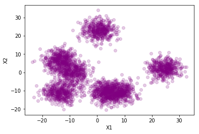
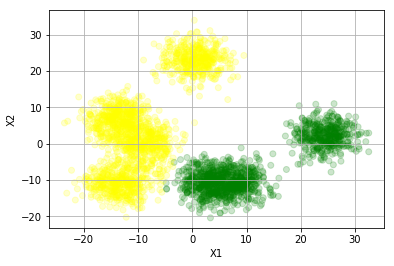
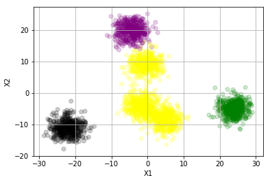
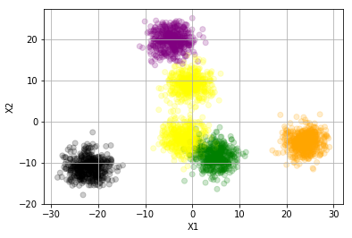
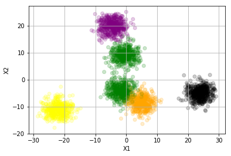
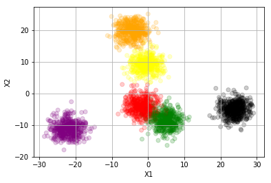
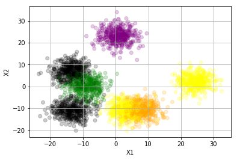
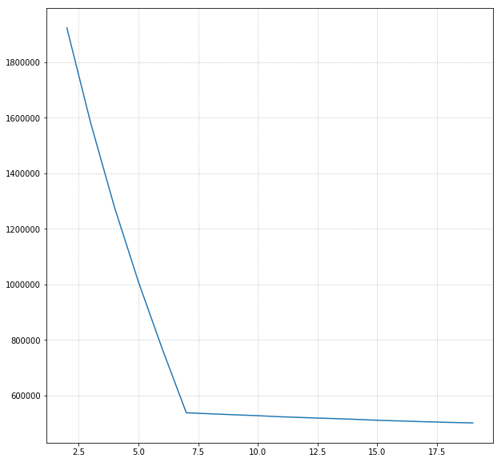

### Questions

- Clustering is limited by dimensions

### Objectives
YWBAT
- measure the correct number of clusters to use
- use various metrics to decide cluster numbers and create a pipeline for new data points

### Outline


```python
import pandas as pd
import numpy as np

from sklearn.datasets import make_blobs
from sklearn.cluster import KMeans
from sklearn.metrics import calinski_harabasz_score, 
from sklearn.model_selection import train_test_split

import matplotlib.pyplot as plt
import seaborn as sns
from sklearn.decomposition import PCA
```


```python
# make a dataset with 20 features and 3 groups 
X, y = make_blobs(n_features= 20, n_samples= 3000, centers = np.random.randint(3, 10), cluster_std=3.0)

```


```python
# let's visualize our data
pca = PCA(n_components = 2)
transformed = pca.fit_transform(X)
transformed[:5]
```


    array([[-2.93476341e+00,  2.62671947e+01],
           [-4.25953668e+00,  2.51428884e+00],
           [-2.25210743e-02, -1.30017013e+01],
           [ 1.79461044e+00,  2.53031724e+01],
           [-1.46983576e+00,  2.52421315e+01]])


```python
plt.scatter(x = transformed[:,0],y = transformed[:,1], alpha=0.2, c='purple')
plt.xlabel("X1")
plt.ylabel("X2")
plt.show()
```





```python
color_dict = {0:"green", 1: "yellow", 2: "black", 3: "purple", 4: "orange", 5: "red", 6:"pink"}
```

### Let's get some clusters


```python
def view_clusters(n_clusters=3, plotting=False):
  kmean = KMeans(n_clusters=n_clusters)
  kmean.fit(X)
  labels = kmean.labels_
  if plotting:
    color_vec = [color_dict[l] for l in labels]
    plt.scatter(x = transformed[:,0],y = transformed[:,1], alpha=0.2, c=color_vec)
    plt.grid()
    plt.xlabel("X1")
    plt.ylabel("X2")
    plt.show()
  return kmean
```


```python
view_clusters(2)
```





```python
view_clusters(4)
```





```python
view_clusters(5)
```





```python
view_clusters(5)
```





```python
view_clusters(6)
```





### How do we choose the number of clusters?


```python
k = view_clusters(5)
```





```python
inertias = []
for i in range(2, 20):
  k = view_clusters(i)
  inertia = k.inertia_
  inertias.append(inertia)
```


```python
plt.figure(figsize=(10, 10))
plt.grid(linestyle=':')
plt.plot(range(2, 20), inertias)
plt.show()
```





### Assessment
